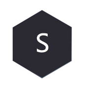
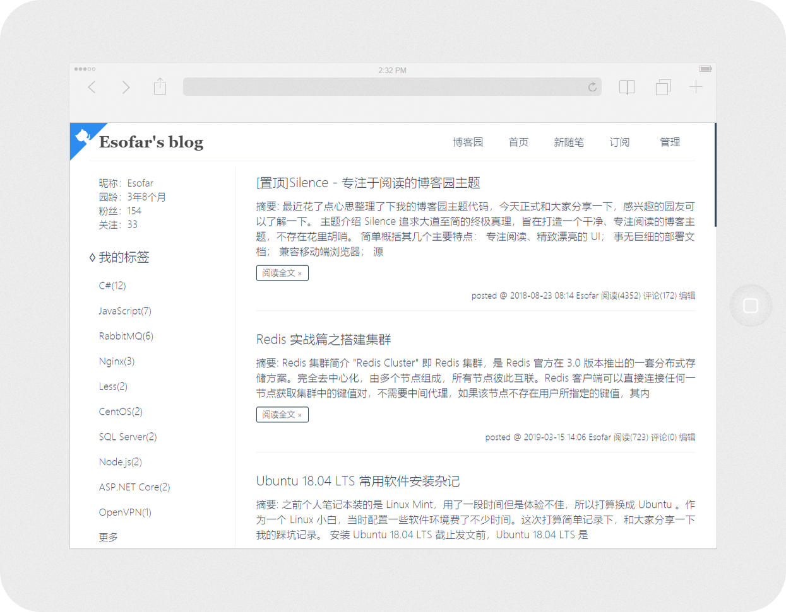
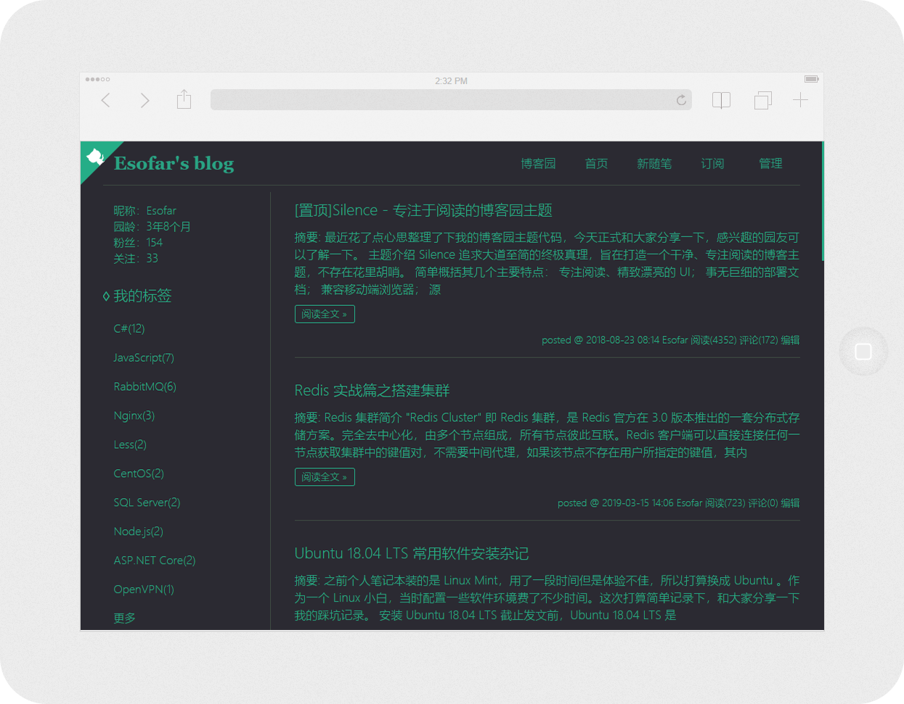
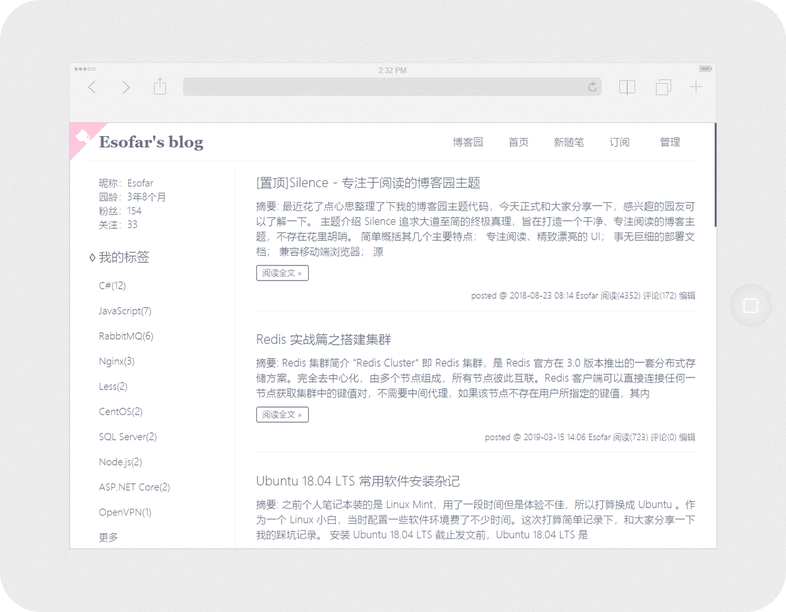

<div align="center">



# Silence

[](https://github.com/esofar/cnblogs-theme-silence/releases)
[](https://www.cnblogs.com)
[](https://github.com/esofar/cnblogs-theme-silence/issues)
[](https://github.com/esofar/cnblogs-theme-silence/blob/master/LICENSE)

</div>

## 介绍

一款专注阅读的博客园主题，主要面向于经常混迹 [博客园](https://www.cnblogs.com/) 的朋友。其追求大道至简的终极真理，界面追求简洁、运行追求高效、部署追求简单。

- [部署文档](./docs/deploy.md)
- [更新日志](./docs/change.md)

## 特性

* :blue_heart: 简洁优雅、精致漂亮的 UI 设计。
* :purple_heart: 提供多种风格主题以便适应各类用户的偏好。
* :heart: 响应式设计，兼容手机端浏览器。
* :green_heart: 提供事无巨细的部署文档。
* :yellow_heart: 源码结构清晰并且注释完整，方便扩展。

## 风格

<div align="center">

简约 · 蓝



暗黑 · 绿



女神 · 粉



</div> 

## 扩展

本主题的样式通过 Less 将一些颜色值作为变量抽取出来，通过不同颜色搭配形成了三种不同的主题风格。当然您也可以搭配自己喜欢的色系，编译一套属于自己的主题风格，也非常欢迎有兴趣的园友贡献更多的配色方案。

克隆源码，进入项目目录：

```
git clone https://github.com/esofar/cnblogs-theme-silence.git
cd cnblogs-theme-silence
```
全局安装用到的一些工具：
```
npm install less less-plugin-clean-css babel-cli uglify-js -g
```

> 如上操作需要依赖 Node.js 环境和 Git 客户端。

本地打开`./src/themes`目录，新建主题样式文件`example.less`，其至少具备类似如下内容结构：

```
@blog-bg-color: #fff;                           // 博客背景颜色
@blog-theme-color: #FF85B8;                     // 博客主题色
@blog-border-color: #ffebf2;                    // 博客边框颜色
@blog-font-color: #61687C;                      // 博客字体颜色
@blog-title-color: #61687C;                     // 博客标题颜色
@blog-github-fill-color: #FFC6DE;               // GitHub 角标背景色

@post-catalog-bg-color: #fffafa;                // 博文目录背景色
@post-catalog-font-color: #a2a2a2;              // 博文目录字体色
@post-table-thead-bg-color: #f9f9f9;            // 博文表格标题背景色
@post-table-border-color: #fbdfeb;              // 博文表格标题边框颜色
@post-inline-code-bg-color: #fbfbfb;            // 博文行内代码背景色
@post-inline-code-border-color: #eee;           // 博文行内代码边框颜色
@post-cnblogs-code-bg-color: #f2f4f5;           // 博文默认代码块背景色
@post-cnblogs-code-font-color: #656c73;         // 博文默认代码块字体色
@post-signature-bg-color: #f8f8f8;              // 博文签名背景色
@post-blockquote-border-color:#FFC6DE;          // 博文引用边框颜色

@comment-font-color: #858ca5;                   // 评论字体色
@comment-bg-color: #ffecf4;                     // 评论背景色

.cnblogs-markdown .hljs {                       // Markdown 编辑器模式代码块样式
    display: block;
    color: #333;
    overflow-x: auto;
    background: #F2F4F5 !important;
    border: none !important;
    font-family: Consolas, Monaco, 'Andale Mono', 'Ubuntu Mono', monospace !important;
    padding: 1em !important;
    font-size: 14px !important;
}

.hljs-comment,
.hljs-meta {
    color: #969896;
}

.hljs-string,
.hljs-variable,
.hljs-template-variable,
.hljs-strong,
.hljs-emphasis,
.hljs-quote {
    color: #df5000;
}

.hljs-keyword,
.hljs-selector-tag,
.hljs-type {
    color: #a71d5d;
}

.hljs-literal,
.hljs-symbol,
.hljs-bullet,
.hljs-attribute {
    color: #0086b3;
}

.hljs-section,
.hljs-name {
    color: #63a35c;
}

.hljs-tag {
    color: #333333;
}

.hljs-title,
.hljs-attr,
.hljs-selector-id,
.hljs-selector-class,
.hljs-selector-attr,
.hljs-selector-pseudo {
    color: #795da3;
}

.hljs-addition {
    color: #55a532;
    background-color: #eaffea;
}

.hljs-deletion {
    color: #bd2c00;
    background-color: #ffecec;
}

.hljs-link {
    text-decoration: underline;
}

// 以上是一些主题必须设置颜色值和样式，可以根据自己的喜好调整。
// 以下可以参考博客园的 DOM 结构自由发挥写一些自己定制的样式。

...

```

文件保存后，需要在公共样式文件`silence.less`头部引入主题`example.less`，并注释其他主题的引用。
```
// @import "./themes/default.less";
// @import "./themes/goddess.less";
// @import "./themes/dark.less";
@import "./themes/example.less";

...
```

然后通过如下命令将动态样式文件`silence.less`转义为普通样式文件并压缩，输出至`dist/themes/example.min.css`：

```
lessc src/silence.less dist/themes/example.min.css -clean-css
```

OK，这样一套自己的主题就搞定了。

如果您需要新增一些交互功能模块，就需要更改`./src/silence.js`脚本文件了，该脚本文件结构非常简单并且有注释。您只要略懂一点 JavaScript 的 ES6 语法就可以很轻松地读懂代码，快速实现自己的定制功能。

定制功能完成后需要通过如下两个命令将脚本文件转义为 ES5 语法，并压缩混淆，输出至`./dist/silence.min.js`：

```
babel src/silence.js -o src/silence.es5.js
uglifyjs src/silence.es5.js -o dist/silence.min.js -c -m
```

最后，再按照「部署文档」中的步骤重新安装即可。

