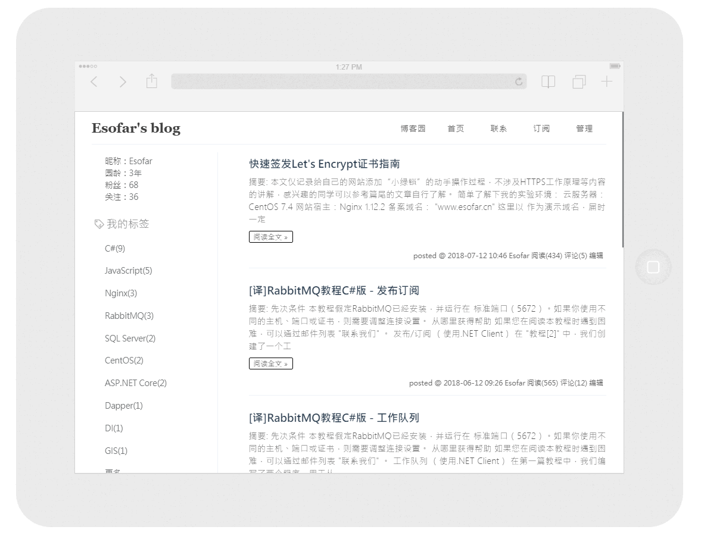

# Silence
[](https://github.com/esofar/cnblogs-theme-silence/releases)
[](https://www.cnblogs.com)
[](https://github.com/esofar/cnblogs-theme-silence/issues)
[](https://github.com/esofar/cnblogs-theme-silence/blob/master/LICENSE)


## 介绍
Silence 是一款界面简洁、运行高效的博客园主题，主要面向于经常混迹博客园的朋友。

简单概括其几个主要特点：
* 专注阅读、精致漂亮的 UI；
* 事无巨细的部署文档；
* 兼容移动端浏览器；
* 源码结构清晰、易扩展。




## 安装

> 开始之前请确保你有一个正常的博客园账号并已经成功申请开通JS权限。

**Step1：主题下载**

通过下面git命令克隆到本地，或者直接下载zip到本地并解压。
```
git clone https://github.com/esofar/cnblogs-theme-silence.git
```
进入`dist`目录，获取发布文件`silence.min.css`和`silence.min.js`。

**Step2：上传博客园**

进入博客园『管理』-『文件』，将`silence.min.js`文件上传到自己的博客。获取上传后的URL地址，然后使用`<script>`标签生成一个脚本引用。参考示例：
```
<script src="https://blog-static.cnblogs.com/files/esofar/silence.min.js"></script>
```
进入『博客园』-『管理』-『设置』，将上面生成的引用复制到「博客侧边栏公告」文本域中。

最后处理样式文件，使用记事本工具打开`silence.min.css`文件，复制其所有代码到「页面定制CSS代码」文本域中即可。


**Step3：开始使用**

进入『博客园』-『管理』-『设置』，将下面代码复制并追加到「博客侧边栏公告」文本域中。

```
<script type="text/javascript">
    $.silence();
</script>
```

同时，该主题自定义了一些其他模块：博客目录、博客签名、支持赞赏等，提供参数配置。由于可能会稍微影响页面加载速度，默认不启用。如需开启请修改上述代码。参考示例：
```
<script type="text/javascript">
    $.silence({
        catalog: {
            enable: true,
            move: true,
            index: true,
            level1: 'h2',
            level2: 'h3',
            level3: 'h4',
        },
        signature: {
            enable: true,
            author: 'Esofar',
            home: 'https://esofar.cn',
            license: '署名 4.0 国际',
            link: 'https://creativecommons.org/licenses/by/4.0'
        },
        reward: {
            enable: true,
            title: '我是猴子派来收钱的',
            wechat: 'https://images.cnblogs.com/cnblogs_com/esofar/972540/o_wechat.png',
            alipay: 'https://images.cnblogs.com/cnblogs_com/esofar/972540/o_alipay.png',
        },        
        github: {
            enable: true,
            color: '#fff',
            fill: '#151513',
            link: 'https://github.com/esofar',
        }
    });
</script>
```

配置项说明详见下表：
<table>
    <thead>
        <tr>
            <td>模块</td>
            <td>属性</td>
            <td>说明</td>
            <td>类型</td>
            <td>默认值</td>
        </tr>
    </thead>
    <tbody>
        <tr>
            <td rowspan="6">catalog</td>
            <td>enable</td>
            <td>是否启用</td>
            <td>Boolean</td>
            <td>false</td>
        </tr>
        <tr>
            <td>move</td>
            <td>是否允许拖拽</td>
            <td>Boolean</td>
            <td>true</td>
        </tr>
        <tr>
            <td>index</td>
            <td>是否显示索引</td>
            <td>Boolean</td>
            <td>true</td>
        </tr>
        <tr>
            <td>level1</td>
            <td>一级标题</td>
            <td>String</td>
            <td>h2</td>
        </tr>
        <tr>
            <td>level2</td>
            <td>二级标题</td>
            <td>String</td>
            <td>h3</td>
        </tr>
        <tr>
            <td>level3</td>
            <td>三级标题</td>
            <td>String</td>
            <td>h4</td>
        </tr>
        <tr>
            <td rowspan="5">signature</td>
            <td>enable</td>
            <td>是否启用</td>
            <td>Boolean</td>
            <td>false</td>
        </tr>
        <tr>
            <td>author</td>
            <td>作者显示名称</td>
            <td>String</td>
            <td>登录用户名</td>
        </tr>
        <tr>
            <td>home</td>
            <td>作者主页</td>
            <td>String</td>
            <td>https://www.cnblogs.com</td>
        </tr>
        <tr>
            <td>license</td>
            <td>许可证名称</td>
            <td>String</td>
            <td>署名 4.0 国际</td>
        </tr>
        <tr>
            <td>link</td>
            <td>许可证链接</td>
            <td>String</td>
            <td>https://creativecommons.org/licenses/by/4.0</td>
        </tr>
        <tr>
            <td rowspan="4">reward</td>
            <td>enable</td>
            <td>是否启用</td>
            <td>Boolean</td>
            <td>false</td>
        </tr>
        <tr>
            <td>title</td>
            <td>标题</td>
            <td>String</td>
            <td>-</td>
        </tr>
        <tr>
            <td>wechat</td>
            <td>微信二维码</td>
            <td>String</td>
            <td>-</td>
        </tr>
        <tr>
            <td>alipay</td>
            <td>支付宝二维码</td>
            <td>String</td>
            <td>-</td>
        </tr>
        <tr>
            <td rowspan="4">github</td>
            <td>enable</td>
            <td>是否启用</td>
            <td>Boolean</td>
            <td>false</td>
        </tr>
        <tr>
            <td>fill</td>
            <td>背景填充色</td>
            <td>String</td>
            <td>#151513</td>
        </tr>
        <tr>
            <td>color</td>
            <td>章鱼猫颜色</td>
            <td>String</td>
            <td>#fff</td>
        </tr>
        <tr>
            <td>link</td>
            <td>Github 链接</td>
            <td>String</td>
            <td>-</td>
        </tr>
    </tbody>
</table>

**Step4：其他配置**

要使主题正常使用，还需要在修改博客园的一些其他配置项。

* 进入『博客园』-『管理』-『设置』，在「标题」文本域中设置博客标题，不支持子标题。

* 进入『博客园』-『管理』-『设置』，在「博客皮肤」处选择博客园官方标准模板**Custom**，并且把「禁用模板默认CSS」复选框取消勾选。

* 进入『博客园』-『管理』-『选项』，在「控件显示设置」需要勾选的模块有：随笔分类、公告、博客园链接、阅读排行榜、我的标签、首页链接、RSS订阅、推荐排行榜、联系，其他模块取消勾选(可选)。

至此，Silence 主题就已经安装完成，赶快打开博客看看效果吧！


## 更新日志

### v1.0.1
* 赞赏按钮不显示时，适当调整其外层 DOM 元素宽度。
* 修复首页随笔分隔符样式不统一的问题。

### v1.0.2
* 修复侧边栏我的标签、随笔分类因标题过长导致换行问题。
* 修复博客目录因标题过长导致换行问题。
* 优化评论区分页样式效果。
* 设置博客赞赏模块二维码固定宽高。
* 优化阅读模式、新增收缩标题栏效果。

### v1.0.3
* 更换全局字体。
* 优化标签列表页面部分样式。
* 优化侧边栏以及博客头部样式。

### v1.0.4
* 优化阅读、正常模式切换效果。
* 修复移动端部分样式存在的问题。

### v1.0.5
* 调整全局字体样式。
* 调整博文引用样式。
* 调整博文行内代码样式。

### v1.0.6
* 调整博客、博文标题左侧边距。
* 设置首页侧边栏、主体DOM元素默认最小高度。

### v1.0.7
* 版权信息输出主题版本号。
* 去除评论框outline效果。
* 博文字体大小调整为`15px`。
* 博文自定义摘要图片样式优化。

### v1.0.8
* 重新调整博文中Table表格样式。
* 调整博客目录最大宽高，优化笔记本小屏幕显示效果。
* 博客详情页面新增博客收藏按钮 [#2](https://github.com/esofar/cnblogs-theme-silence/issues/2) 。

### v1.0.9
* 优化移动端浏览器存在的若干样式问题。
* 博客导航在移动端浏览器中显示标签页链接。
* 修复博文标题行内代码样式不统一的问题。
* 新增 [GitHub Corners](http://tholman.com/github-corners/)，通过`github`选项配置相关参数。

### v1.1.0
* 调整博客图片为居中显示。
* 调整博客标题、段落上下间距。
* 调整非 markdown 编辑模式下代码风格。
* 新增代码复制按钮，该功能依赖 [clipboard.js](https://github.com/zenorocha/clipboard.js) 插件完成。
* 博客详情页面新增博主关注按钮 [#1](https://github.com/esofar/cnblogs-theme-silence/issues/1) 。

### v1.1.1
* 修复代码复制按钮在非 markdown 编辑模式下位置错乱问题。
* 修复关注按钮被博客签名区域遮挡问题 [#6](https://github.com/esofar/cnblogs-theme-silence/issues/6) 。
* 优化关注按钮点击事件内部逻辑。
* 修复目录有序索引 title 显示异常问题。
* 修复手机端博文图片缩放问题。
* 优化博文标题显示效果。

### v1.1.2
* 修复若干手机端适配问题。
* 调整标签列表页面显示效果。

### v1.1.3
* 新增右下角快捷操作工具栏。
* markdown 编辑模式下代码背景调整为亮色。

