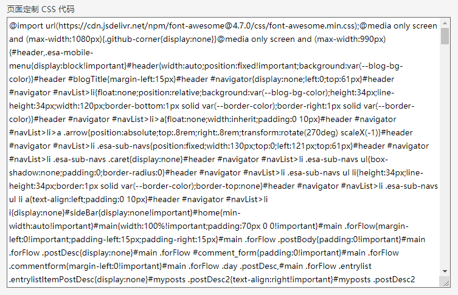
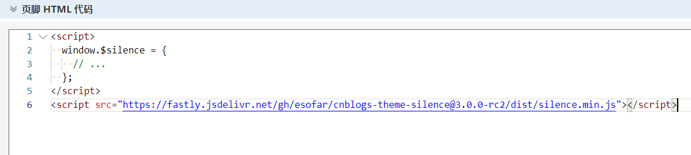
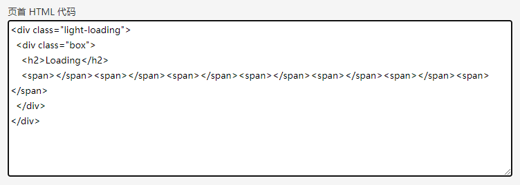
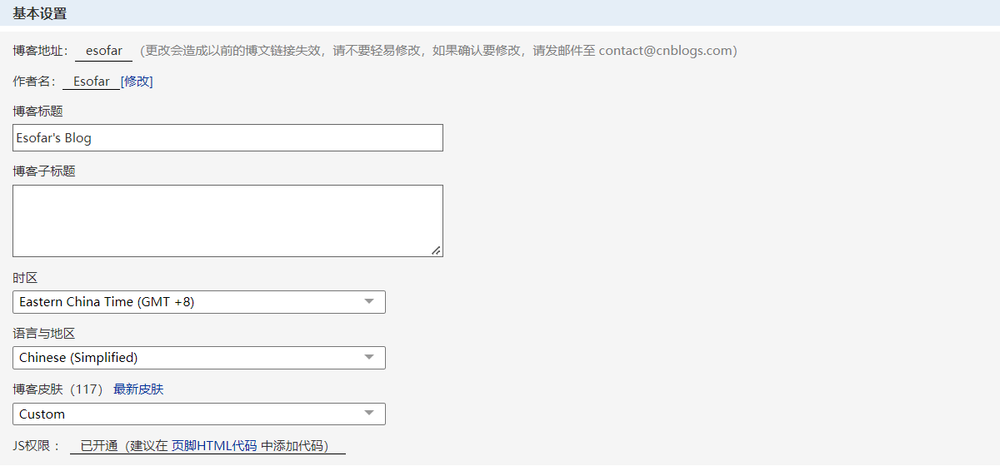

# 部署指南

部署之前请先确认您的博客园账号已正常登陆，并且已联系管理员成功申请开通了 JS 权限。然后进入博客后台「设置」Tab页中完成下列配置。

## 获取库文件

因为该主题在 Github 上开源，可以直接使用 [jsDelivr](https://www.jsdelivr.com/) 提供的免费 CDN 服务获取 JS/CSS 文件。
 
```
https://fastly.jsdelivr.net/gh/esofar/cnblogs-theme-silence@3.0.0-beta3/dist/silence.min.css
https://fastly.jsdelivr.net/gh/esofar/cnblogs-theme-silence@3.0.0-beta3/dist/silence.min.js
```
> 已发行版本请参见 [releases](https://github.com/esofar/cnblogs-theme-silence/releases)，建议使用最新版本。


## 配置 CSS 

在「页面定制 CSS 代码」处，将上述获取的 CSS 样式文件外链通过浏览器打开，然后将代码全部粘贴到这里。



## 配置 JS

在「博客侧边栏公告」处，配置用户选项并加载 JS 脚本文件。`window.$silence`取值请参见 [配置选项](/options?id=配置选项)。



## 配置 Loading

在「页首 HTML 代码」处，从下面选择一种风格的 HTML 代码粘贴到这里。



- 亮色风格

``` light
<div class="light-loading">
  <div class="box">
    <h2>Loading</h2>
    <span></span><span></span><span></span><span></span><span></span><span></span><span></span>
  </div>
</div>
```

- 暗色风格

``` dark
<div class="dark-loading">
  <div class="box">
    <h2>Loading</h2>
    <span></span><span></span><span></span><span></span><span></span><span></span><span></span>
  </div>
</div>
```
> 为了避免因网络不好等情况导致页面加载卡顿，造成不好的用户体验，给页面添加 Loading 效果还是非常有必要的。

## 其他配置

1. 「标题」处设置博客标题，注意不支持显示「子标题」。



2. 「博客皮肤」处选择标准模板`Custom`。


3. 「禁用模板默认CSS」需要打对勾。

